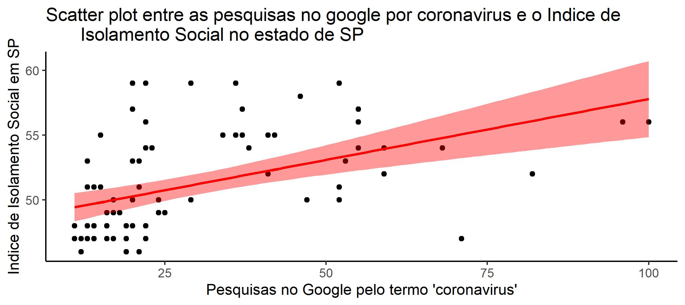
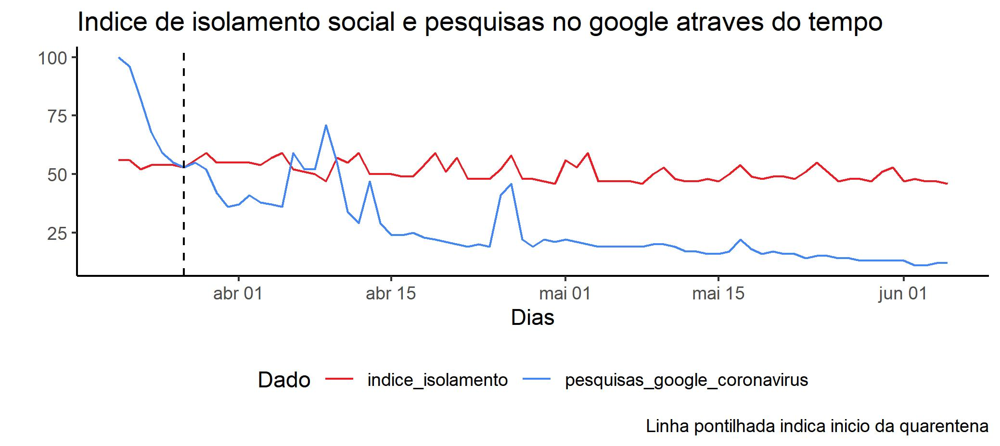
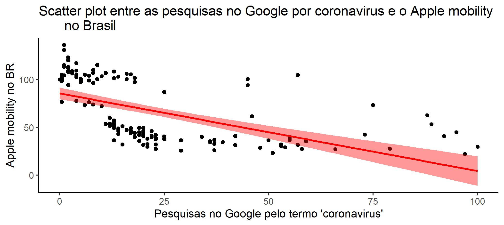
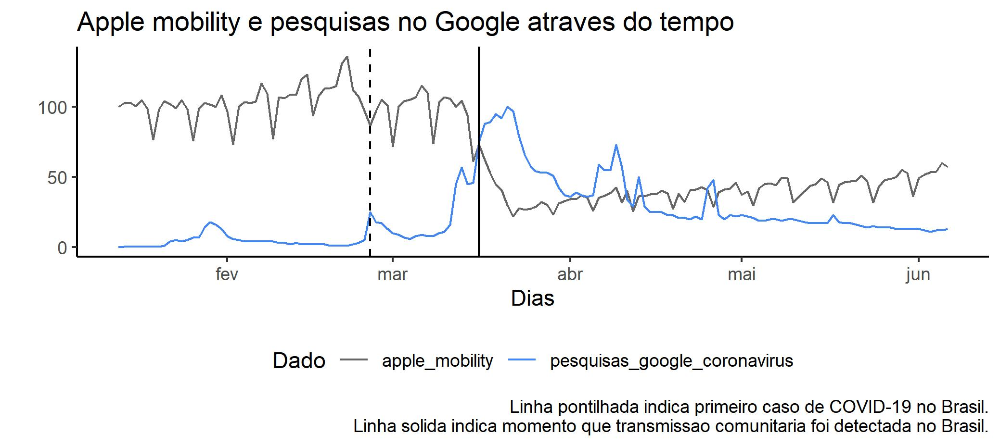

# IsolamentoSocial.Gtrends

<!-- badges: start -->
<!-- badges: end -->

O objetivo deste repositório foi conduzir análises para ver a relação entre o número de buscas no google pelo termo "coronavirus" e a taxa de isolamento social no estado de SP e no Brasil. Para isso foram usados [dados do governo de SP](https://www.saopaulo.sp.gov.br/coronavirus/isolamento/) e do [Apple mobility](https://www.apple.com/covid19/mobility).

Parte-se do pressuposto que número de pesquisas no Google com o termo "coronavirus" estaria relacionado com o engajamento da população em relação a pandemia. Dessa forma, quanto maior o número de pesquisas pelo termo "coronavirus", mais engajamento e mais interesse em se manter informado e se proteger nesse período de pandemia. Do contrário, quanto  menos buscas, menor o engajamento público com a pandemia, demonstrando menos interesse pelo tema. Sendo assim, um menor interesse poderia estar associado com um maior comportamento de risco em relação ao vírus. 

Portanto, a hipótese do presente estudo foi de que quanto menor o número de buscas no Google pelo termo "coronavirus", menor seria o engajamento público com o isolamento social. No caso dos dados de SP, era esperado uma relação positiva entre os dados do Google e o índice de isolamento social, uma vez que os dados do índice de isolamento social são a porcentagem de pessoas que se mantiveram em isolamento. Já os dados do Brasil, esperou-se que houvesse uma correlação inversamente proporcional, tendo em vista que os dados do Apple mobility são a porcentagem de maior ou menor movimentação das pessoas com referência no dia 13 de janeiro de 2020. Logo, quanto maior o isolamento, o número do Apple mobility seria menor.

## Dados do Estado de SP
Os dados do estado de SP foram dados coletados entre o dia 2020-03-05 e o dia 2020-06-05. Por conta de variações muito severas nos finais de semana, quando os dados acabavam por serem bem menores que o normal, optou-se por usar apenas os dados que estavam acima de 45% do isolamento social. Evidentemente, foi usado os dados do índice de isolamento social do estado de SP, e as buscas no Google somente foram consideradas quando feitas no estado de SP. Esses dados apontaram para uma correlação de 0.59 (p < 0.001) entre as buscas no Google e o índice de isolamento social. A imagem a seguir demonstra a correlação entre as duas variáveis, bem como uma linha de tendência.

É importante ressaltar que mesmo usando os dados de todos os dias, sem separar os dados com isolamento abaixo de 45%, foi constatada uma correlação significativa (p = 0.001). Nesse caso a correlação foi de 0.35, apontando uma magnitude de efeito média.

Também é possível analisarmos os dados perante o tempo. Para isso, foi feito um gráfico das séries temporais com os dados do índice de isolamento social e das buscas do Google. A imagem a seguir é o gráfico mencionado.

Por fim, foi conduzida uma regressão linear entre esses dados. A variável preditora foi as buscas no Google enquanto variável dependente foi o índice de isolamento social. Um total de 21.34% da variação nos dados do índice de isolamento social foram por conta do número de buscas no Google, que seria uma medida de engajamento populacional com a pandemia. Os resultados na regressão linear, como por exemplo os coeficientes e a significância do modelo, podem ser encontrados [nesse link](data/lm_sp.txt).

## Dados do Brasil
Os dados do Brasil foram dados coletados entre o dia 2020-01-13 e o dia 2020-06-05. Os dados do Apple mobility tinham dados faltantes nos dias 11 e 12 de maio. Para evitar perdas de dado, foi feita uma interpolação linear nesses dias, usando o dado dos dias adjacentes para conseguir encontrar um valor nesses dias. Evidentemente, só foram usados dados do Brasil para o Apple mobility, enquanto as buscas no Google foram consideradas para o território brasileiro inteiro. A medida do Apple mobility e as buscas no Google apontaram para uma correlação de -0.78 (p < 0.001). A imagem a seguir demonstra a correlação entre as duas variáveis, e também é apresentado sua linha de tendência.

Igual foi feito com os dados de SP, também foi decidido apresentar os dados linearmente através das datas. Assim, foi feito um gráfico de séries temporais para os dados do Apple mobility e as buscas no Google. A imagem a seguir é o gráfico descrito.

Finalmente, também foi conduzida uma regressão linear entre os dados do território brasileiro. A variável preditora foi as buscas no Google enquanto variável dependente foi os dados da Apple mobility. Um total de 32.48% da variação nos dados da Apple mobility foram por conta do número de buscas no Google. Lembrando que essa medida seria uma medida de engajamento populacional com a pandemia. Os coeficiente e a significância do modelo de regressão linear ser encontrados [nesse link](data/lm_br.txt).

## Conclusão
Como hipotetizado, houve uma correlação entre os dados de engajamento para o isolamento social e o interesse populacional pelas buscas relacionadas ao coronavírus. Porém, é necessário ressaltar que as análises conduzidas aqui não são causais. Dessa forma, não é possível ter certeza da direção da relação. É possível discutir que há outras variáveis, que não foram exploradas aqui, que podem estar exercendo algum efeito nas variáveis aqui apresentadas. Uma possível explicação seria que com o passar do tempo, a população começaria aos poucos a sair de casa por conta de diversas necessidades (e.g., profissionais), e por conta disso a taxa de isolamento iria diminuir. Também, por conta de mais tempo fora de casa, as pessoas acabariam por fazer menos buscas no Google para saber sobre o tema da pandemia, não indicando necessariamente um menor engajamento psicológico, mas simplesmente por conta da falta de tempo.

De qualquer forma, os resultados aqui apresentados possuem sua validade na forma como as pessoas tem lidado com a pandemia e quais comportamentos elas apresentam em decorrência disso. Novas análises são necessárias para se entender melhor a relação entre as medidas aqui estudadas.
